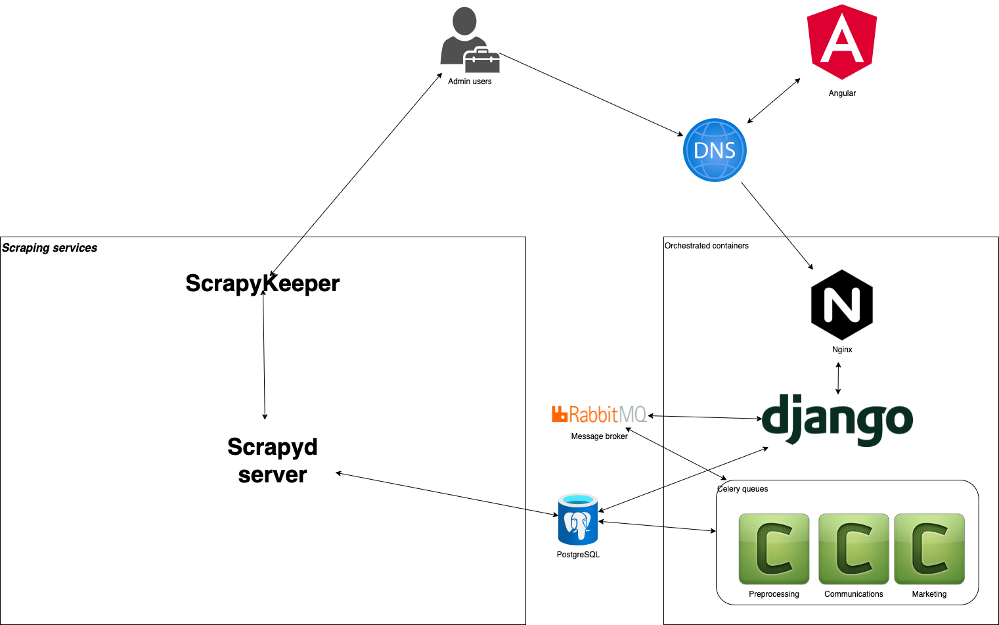

# Propefy tech stack

## Django and Celery
We're using celery and django in order to handle parallel processing, all heavy tasks and communication libraries (such as twilio and sendgrid) are handled asynchronously so we avoid any delays in the response of our servers.

## Django admin
Basic Django admin is used to publish properties and handle other data.

## RabbitMQ
RabbitMQ is our message broker, used to intermediate communications between Celery and Django.

## Scrapyd
Scrapyd is an application for deploying and running Scrapy spiders. It enables you to deploy (upload) your projects and control their spiders using a JSON API.

